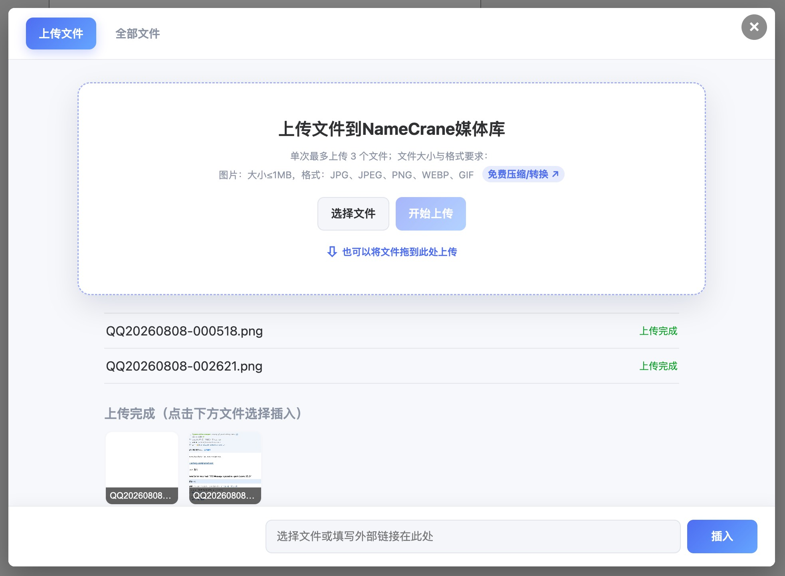
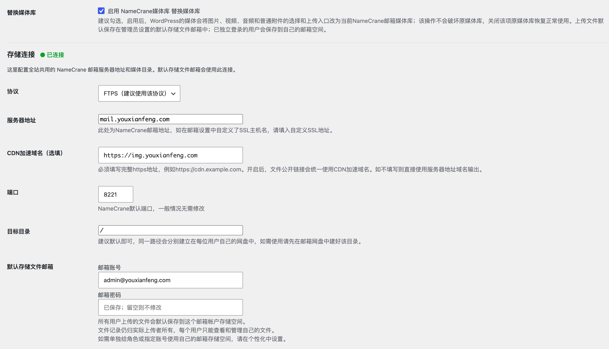
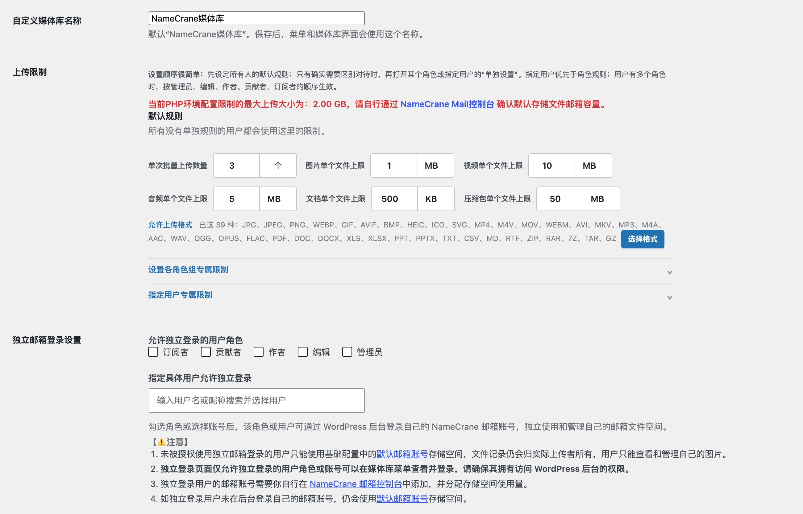

# NameCrane Mail To WordPress媒体库

因NameCrane Mail邮箱有终身有效的云存储空间，邮箱服务完全用不到这么多空间，而本人的WordPress网站服务器存储空间已捉襟见肘，所以开发该插件主要用于将 **NameCrane Mail 邮箱与网盘空间**取代 WordPress 媒体库。上传的图片、视频、音频、文档和压缩包会自动保存到 NameCrane 文件空间中，并自动生成公开链接，停用插件完全不会影响WordPress本身的媒体库功能。

> 适合已有 NameCrane Mail 邮箱与文件存储空间，希望用自己的邮件网盘承载 WordPress 媒体的站点。

## 能做什么

- 用 NameCrane Mail 文件空间存放 WordPress 媒体，不占用网站主机磁盘。
- 可替换 WordPress 标准媒体入口；文章、页面和支持标准媒体框的主题入口都会使用同一套媒体选择窗口。
- 上传成功后可直接插入编辑器或回填外部文件地址。
- 每位用户只能查看、管理自己的文件记录；管理员可统一管理全部文件。
- 支持 FTPS 和 SFTP，支持填写 CDN 加速域名输出公开链接。
- 支持默认存储邮箱，也支持让指定角色组或指定用户登录自己的 NameCrane Mail 账户。
- 可按文件类型限制上传数量、大小和格式。
- 可自定义媒体库名称。

## 支持的文件格式

文件的格式支持取决于NameCrane Mail邮箱允许上传到邮件的格式，具体如下：
- 图片：JPG、JPEG、PNG、WEBP、GIF、AVIF、BMP、HEIC、ICO、SVG
- 视频：MP4、M4V、MOV、WEBM、AVI、MKV
- 音频：MP3、M4A、AAC、WAV、OGG、OPUS、FLAC
- 文档：PDF、DOC、DOCX、XLS、XLSX、PPT、PPTX、TXT、CSV、MD、RTF
- 压缩包：ZIP、RAR、7Z、TAR、GZ

## 界面预览

| 上传文件 | 管理文件 |
| --- | --- |
|  |  |

## 使用前准备

1. 准备一个可用的 NameCrane Mail 邮箱账户，并在其网页邮箱中确认文件存储功能可用。
2. 服务器 PHP 需要启用 cURL；若要使用 SFTP，服务器的 cURL 还需要带 SFTP 支持。
3. 登录 WordPress 后台的管理员账户。

## 安装

1. 在本仓库的 Releases 下载插件压缩包。
2. WordPress 后台进入“插件 → 安装插件 → 上传插件”，上传压缩包并启用。
3. 首次启用会跳转到“NameCrane 媒体库 → 设置 → 基础配置”。
4. 填写并保存配置。保存时插件会立即测试文件存储和网页接口连接。

## 基础配置

在“NameCrane 媒体库 → 设置 → 基础配置”中填写：

| 设置项 | 怎么填 |
| --- | --- |
| 协议 | 推荐 FTPS。若你的服务器 cURL 已支持 SFTP，也可选择 SFTP。 |
| 服务器地址 | NameCrane 默认填写 `eu1.workspace.org`；若你在 NameCrane 设置了自定义 SSL 主机名，则填写自定义地址。 |
| CDN 加速域名 | 选填，必须带 `https://`，例如 `https://cdn.example.com`。填写后，公开链接会使用该域名。 |
| 端口 | FTPS 默认 `8221`，SFTP 默认 `8222`。 |
| 目标目录 | 建议保留 `/`。如填写子目录，请先在 NameCrane 网盘中建立该目录。 |
| 默认存储文件邮箱 | 必填。所有未独立登录的用户上传文件都会保存到该邮箱空间；文件记录仍只归实际上传者所有。 |

保存后，页面会显示“已连接”或明确的失败原因。服务器无法连接时请检查地址、协议、端口和目录；账号密码错误时请重新输入邮箱账号与密码。

## 如何上传和插入文件

1. 在文章、页面或主题的标准媒体入口点击“上传/添加媒体”，会自动打开 NameCrane 媒体上传窗口。
2. 在 NameCrane 媒体库窗口选择“上传文件”，可点击选择文件，也可直接拖入文件，单次批量上传数量可在后台自定义。
3. 上传完成后，选中已目标文件，右下角链接会自动填入并可插入。
4. 点击“插入”，即可写入文章编辑器或当前的文件地址输入框。

NameCrane 媒体上传窗口也支持手动粘贴外部链接，再点击“插入”回填。

## 用户与上传限制

- **默认规则**：控制单次上传数量、各类文件的大小和允许格式限制。
- **设置各角色组专属限制**：可独立设置各角色组专属的单次上传数量、各类文件的大小和允许格式限制。
- **指定用户专属限制**：可独立设置任意用户专属的上传数量、各类文件的大小和允许格式限制。
- **独立邮箱登录**：可让指定角色组或指定任意用户通过 WordPress 后台登录自己的 NameCrane Mail 账户，单独使用自己的文件空间。

如你所使用的主题本身支持上传限制，插件默认规则将不会被主题上传限制覆盖；插件会在上传前和服务端再次校验。

## NameCrane Mail 服务

NameCrane 的 CraneMail 提供自定义域名邮箱、网页邮箱、联系人与日历、文件存储与公开分享等功能。本插件利用其中的文件存储和公开分享能力作为 WordPress 媒体空间。

- [查看 CraneMail 生命周期套餐](https://namecrane.com/store/email-hosting-deals)
- [查看 CraneMail 功能与常规套餐](https://namecrane.com/cranemail-email-hosting)
- [NameCrane Mail 控制台](https://namecrane.com/clientarea.php)

根据 NameCrane 当前公开页面，250GB 生命周期套餐为一次性付费75美元终身有效，包含邮件与云存储、最多 25 个主域名和不限邮箱账户；实际价格、套餐内容与可用地区请始终以其官网下单页为准。本项目不含任何未经官方确认的推广请自行分辨。

## 安全说明

- 本插件只把邮箱密码加密保存在使用者自己的 WordPress 数据库中；
- 请不要把数据库导出、设置导出或包含密码的截图提交到 Issue。
发现安全问题请不要公开提交 Issue，请发送邮件至 [admin@youxianfeng.com](mailto:admin@youxianfeng.com)。

## 开发与反馈

欢迎提交 Issue，反馈兼容性、界面和使用问题。提交反馈时请说明 WordPress 版本、PHP 版本、主题名称，以及是否使用 FTPS 或 SFTP；不要附上邮箱密码、令牌或完整公开链接。
